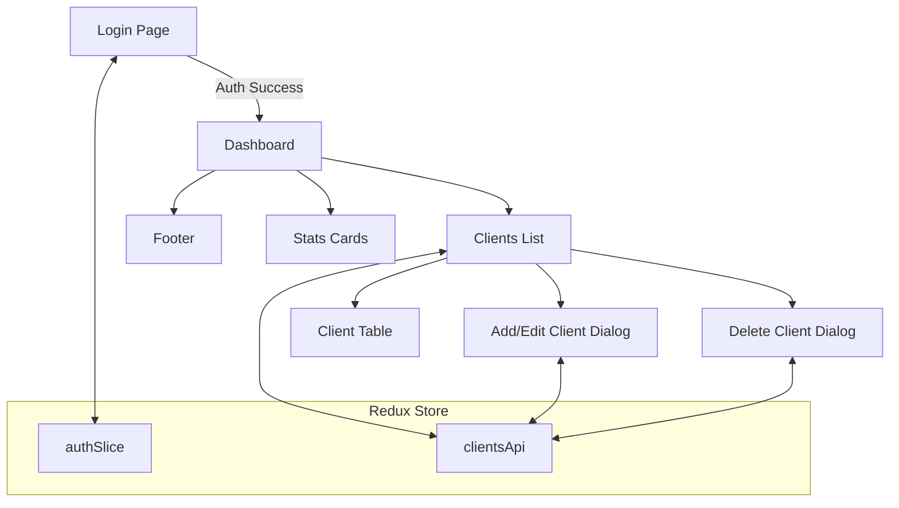

# Mini Loyalty System – Web Backoffice

A modern, responsive backoffice dashboard for managing a loyalty program, built with React, Redux Toolkit, and Material UI.

<div align="center">

  

</div>

---

## 📸 Screenshots

<div align="center">
 


</div>

---

## 🎥 Video Demo

https://github.com/user-attachments/assets/f55809be-fcce-4894-b366-2d576e6f903c

---

## 📝 Features

- **Authentication**: Secure login for admin users.
- **Client Management**: Add, edit, delete, and search loyalty clients.
- **Points & Visits**: Track points and store visits per client.
- **Modern UI**: Responsive, animated, and accessible Material UI design.
- **Persistent Data**: Client data is stored in browser localStorage for demo purposes.
- **Demo Credentials**: Use the demo button on the login screen to auto-fill credentials.

---

## 🛠️ Getting Started

### Prerequisites

- Node.js (v16+ recommended)
- npm

### Installation

```bash
git clone https://github.com/yourusername/mini-loyalty-system.git
cd mini-loyalty-system/web-backoffice
npm install
```

### Running Locally

```bash
npm start
```

Open [http://localhost:3000](http://localhost:3000) in your browser.

### Demo Login

- **Email:** `admin@popcard.com`
- **Password:** `popcard2025`

---

## 🗂️ Project Structure

```
mini-loyalty-system/
├── web-backoffice/
│   ├── public/
│   └── src/
│       ├── app/
│       ├── features/
│       ├── components/
│       ├── pages/
│       ├── utils/
│       ├── index.js
│       └── App.js
└── README.md
```

- **public/**: Static files and index.html
- **src/**: React components, pages, and Redux logic
- **app/**: Redux store configuration
- **features/**: Redux slices and async thunks
- **components/**: Reusable UI components
- **pages/**: Page components for routing
  
---

## 🗺️ System Flow Diagram



---

## 📚 Learning Resources

- **React Documentation**: [React Docs](https://reactjs.org/docs/getting-started.html)
- **Redux Toolkit Documentation**: [Redux Toolkit Docs](https://redux-toolkit.js.org/introduction/getting-started)
- **Material UI Documentation**: [Material UI Docs](https://mui.com/getting-started/installation/)

---

## 📄 License

This project is licensed under the MIT License - see the [LICENSE](LICENSE) file for details.

---

**Happy Coding**

