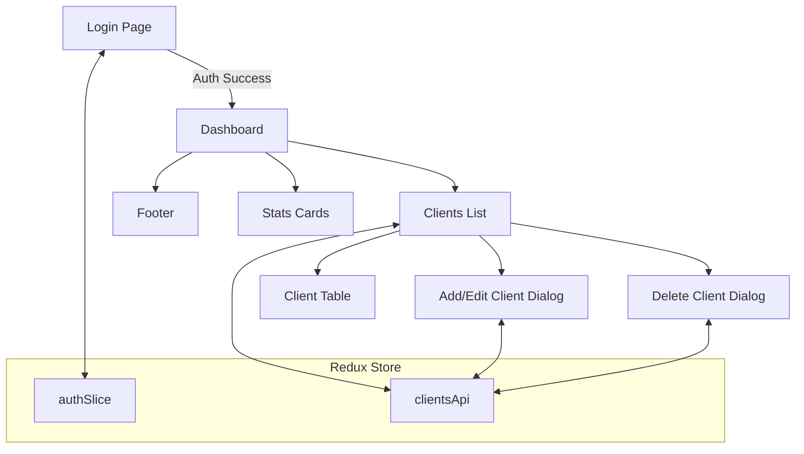

# Mini Loyalty System – Web Backoffice

A modern, responsive backoffice dashboard for managing a loyalty program, built with React, Redux Toolkit, and Material UI.

---

## 📸 Screenshots


---

## 🎥 Video Demo

[](https://www.youtube.com/watch?v=VIDEO_ID_HERE)

> _Replace `VIDEO_ID_HERE` with your uploaded demo video ID or link._

---

## 📝 Features

- **Authentication**: Secure login for admin users.
- **Client Management**: Add, edit, delete, and search loyalty clients.
- **Points & Visits**: Track points and store visits per client.
- **Modern UI**: Responsive, animated, and accessible Material UI design.
- **Persistent Data**: Client data is stored in browser localStorage for demo purposes.
- **Demo Credentials**: Use the demo button on the login screen to auto-fill credentials.

---

## 🛠️ Getting Started

### Prerequisites

- Node.js (v16+ recommended)
- npm

### Installation

```bash
git clone https://github.com/yourusername/mini-loyalty-system.git
cd mini-loyalty-system/web-backoffice
npm install
```

### Running Locally

```bash
npm start
```

Open [http://localhost:3000](http://localhost:3000) in your browser.

### Demo Login

- **Email:** `admin@popcard.com`
- **Password:** `popcard2025`

---

## 🗂️ Project Structure

```
mini-loyalty-system/
├── web-backoffice/
│   ├── public/
│   └── src/
│       ├── app/
│       ├── features/
│       ├── components/
│       ├── pages/
│       ├── utils/
│       ├── index.js
│       └── App.js
└── README.md
```

- **public/**: Static files and index.html
- **src/**: React components, pages, and Redux logic
- **app/**: Redux store configuration
- **features/**: Redux slices and async thunks
- **components/**: Reusable UI components
- **pages/**: Page components for routing
- **utils/**: Utility functions and constants

---

## 🗺️ System Flow Diagram



---

## 📚 Learning Resources

- **React Documentation**: [React Docs](https://reactjs.org/docs/getting-started.html)
- **Redux Toolkit Documentation**: [Redux Toolkit Docs](https://redux-toolkit.js.org/introduction/getting-started)
- **Material UI Documentation**: [Material UI Docs](https://mui.com/getting-started/installation/)

---

## 🤝 Contributing

Contributions are welcome! Please follow these steps:

1. Fork the repository
2. Create a new branch (`git checkout -b feature/YourFeature`)
3. Make your changes
4. Commit your changes (`git commit -m 'Add some feature'`)
5. Push to the branch (`git push origin feature/YourFeature`)
6. Open a pull request

---

## 📄 License

This project is licensed under the MIT License - see the [LICENSE](LICENSE) file for details.

---

## 👀 Acknowledgments

- [Create React App](https://github.com/facebook/create-react-app) for bootstrapping the project.
- [Redux Toolkit](https://redux-toolkit.js.org/) for simplified Redux development.
- [Material UI](https://mui.com/) for the beautiful UI components.
